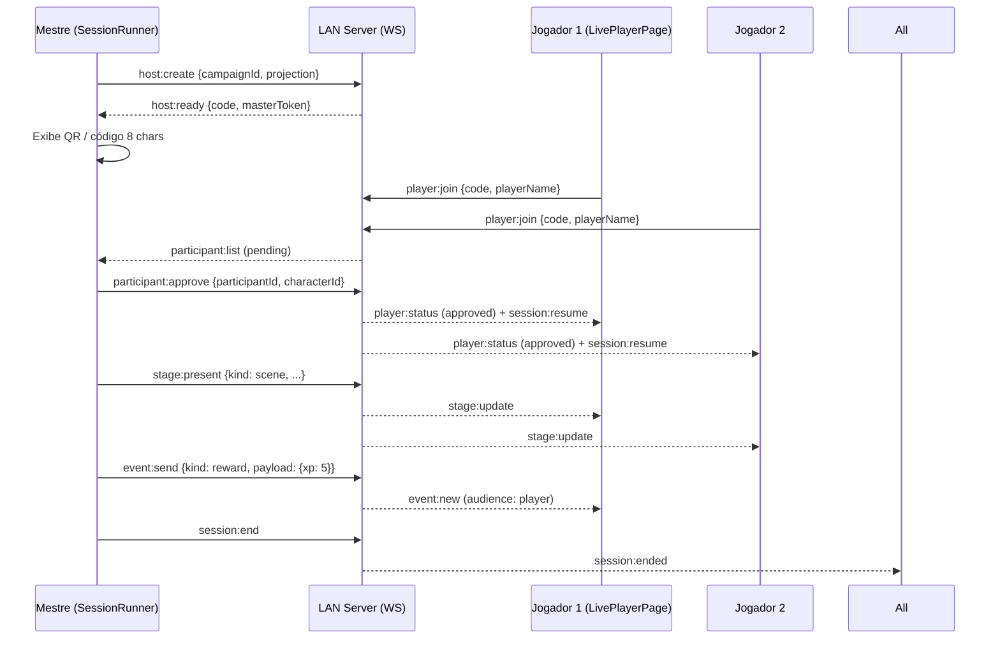

# V1 Architecture — Dungeon Keeper Presencial

> Documentação da arquitetura da V1 (branch `v1-presencial`).  
> Gerado em 2026-08-19. Reflete o estado implementado e validado em 114/114 testes.

---

## Visão Geral

Arquitetura em camadas para RPG presencial (LAN), com foco em:

- **Autoridade do servidor** — estado da sessão, aprovação, projeção, palco, eventos
- **Ruleset isolado** — domínio de regras desacoplado de UI (`src/rulesets/`)
- **Personagem persistente** — pertence ao jogador, não à campanha (`src/domain/v1.ts`)
- **Tema por ruleset** — visual radicalmente diferente (`theme-paranormal` inicial)
- **Offline-first / PWA** — IndexedDB + Service Worker (vite-plugin-pwa)
- **Realtime LAN** — WebSocket servidor autoritativo (`server/lan-server.mjs`)

---

## Camadas

```
┌─────────────────────────────────────────────────────────────┐
│                      UI / React (PWA)                       │
│  ┌──────────────┐ ┌──────────────┐ ┌────────────────────┐  │
│  │ MasterStudio │ │ SessionRunner│ │ LivePlayerPage     │  │
│  │ (preparação) │ │ (diretor)    │ │ (mobile-first)     │  │
│  └──────────────┘ └──────────────┘ └────────────────────┘  │
├─────────────────────────────────────────────────────────────┤
│                    Ruleset Layer                             │
│  ┌──────────────────────────────────────────────────────┐  │
│  │ RulesetRegistry → ordemCompatibleRuleset (V1)         │  │
│  │   - CharacterSchema, DiceRules, CombatRules, Theme    │  │
│  │   - Capabilities (AI, custom sheet, commercial, etc)  │  │
│  └──────────────────────────────────────────────────────┘  │
├─────────────────────────────────────────────────────────────┤
│                    Domain Layer (V1)                         │
│  src/domain/v1.ts — tipos canônicos da V1                   │
│  - Character, CharacterVersion, CampaignCharacter           │
│  - CharacterHistoryEvent, CharacterParticipation            │
│  - LibraryEntity (16 kinds), DiceLogEntry, SessionFeedback  │
│  - RecordingConsent, Wallet, FeatureEntitlement, SocialStub │
├─────────────────────────────────────────────────────────────┤
│                    Realtime Layer                            │
│  ┌──────────────────────┐   ┌──────────────────────────┐   │
│  │ LiveSessionContext   │◄──►│ lan-server.mjs (Node)    │   │
│  │ (client WebSocket)   │ WS │ - host:create/resume     │   │
│  │ - reconnect + jitter │    │ - player:join + approve  │   │
│  │ - deduplicação       │    │ - session:state + stage  │   │
│  │ - projection sanitize│    │ - event:send + ack       │   │
│  └──────────────────────┘    │ - persistence (JSON)     │   │
│                              │ - Origin validation      │   │
│                              │ - rate limit (80/10s)    │   │
│                              │ - maxPayload 2MB         │   │
│                              └──────────────────────────┘   │
├─────────────────────────────────────────────────────────────┤
│                    Persistence                               │
│  - IndexedDB (client) — characters, library, settings       │
│  - .data/lan-sessions.json (server) — sessões LAN           │
│  - Supabase opcional (futuro) — sync remoto                 │
└─────────────────────────────────────────────────────────────┘
```

---

## Regras de Camada

| Camada | Não pode importar de | Pode importar de |
|--------|---------------------|------------------|
| UI (pages, components) | server/, realtime/ internals | rulesets/, domain/, lib/, hooks/ |
| Ruleset | UI, server, realtime | domain/ (apenas types), lib/ |
| Domain (v1.ts) | tudo | — (tipos puros) |
| Realtime (client) | server/ | domain/, rulesets/, lib/ |
| Server (lan-server.mjs) | UI, client | domain/ (tipos), node:std |

---

## Fluxo Principal — Sessão Presencial



---

## Protocolo WebSocket (lan-server.mjs)

### Mensagens Cliente → Servidor

| Tipo | Remetente | Payload | Descrição |
|------|-----------|---------|-----------|
| `host:create` | Mestre | `{campaignId, campaignTitle, projection?, resumeToken?}` | Inicia ou retoma sessão |
| `player:join` | Jogador | `{code, playerName, reconnectToken?}` | Entra na sessão |
| `participant:approve` | Mestre | `{participantId, approved, characterId?}` | Aprova/recusa jogador |
| `session:state` | Mestre | `{projection}` | Atualiza projeção (personagens, mapa, etc) |
| `stage:present` | Mestre | `{stage: StagePresentation}` | Apresenta conteúdo no Palco |
| `event:send` | Mestre/Jogador | `{actionId, event: {kind, payload, audience}}` | Envia evento (dado, recompensa, etc) |
| `session:end` | Mestre | `{}` | Encerra sessão |

### Mensagens Servidor → Cliente

| Tipo | Destinatário | Descrição |
|------|--------------|-----------|
| `host:ready` | Mestre | `{code, masterToken, resumed}` |
| `player:status` | Jogador | `{participant, campaignTitle}` |
| `participant:list` | Mestre | Lista de participantes |
| `session:resume` | Todos | Estado completo ao conectar/reconectar |
| `session:state` | Jogadores | Projeção sanitizada (só próprio personagem) |
| `stage:update` | Audiência | Palco atualizado |
| `event:new` | Audiência | Evento deduplicado |
| `event:ack` | Remetente | `{actionId, duplicate: boolean}` |
| `session:ended` | Todos | Sessão encerrada |
| `error` | Qualquer | Erro de protocolo |

---

## Deduplicação e Reconexão

### Server-side (lan-server.mjs)

- **actionIds** — `Set<string>` por sessão, cleanup a cada 50 eventos
- **Dedup check-then-add** atômico (single-threaded event loop)
- **Persistência** — actionIds serializados no JSON (slice -500)
- **Reconexão single-connection (P4)** — ao reconectar, fecha WS anterior do mesmo participantId

### Client-side (LiveSessionContext.tsx)

- **Reconnect com jitter** — `delay = min(10s, 500 * 2^attempts) * (0.5 + random*0.5)`
- **Idempotência de eventos** — ignora `event:new` com `id` já visto
- **Token de reconexão** — salvo no localStorage por código de sessão
- **Estados de conexão** — `offline` | `connecting` | `connected` | `reconnecting` | `error`

---

## Projeção e Privacidade

### Conceito

O servidor mantém a **projeção completa** (todos os personagens, mapa, névoa, etc). Ao enviar para jogadores, **sanitiza**:

```typescript
function projectForParticipant(projection, participant) {
  return {
    ...projection,
    characters: projection.characters?.filter(c => c.id === participant.characterId) || [],
  }
}
```

### Audience Filtering (Palco + Eventos)

| Audience.kind | Quem recebe |
|---------------|-------------|
| `all` | Mestre + todos jogadores aprovados |
| `master` | Apenas Mestre |
| `player` | Mestre + jogador específico (`participantIds: string[]`) |

**Implementado em:**
- `lan-server.mjs:127-130` — `relevantToParticipant()`
- `lan-server.mjs:202-210` — `broadcastEvent()`
- `lan-server.mjs:191-199` — `broadcastStage()`
- `LiveSessionContext.tsx:134` — aplica stage recebido

---

## Palco (Stage)

### Tipos V1

| Tipo | Uso | Campos principais |
|------|-----|-------------------|
| `scene` | Cena narrativa | `title`, `body`, `imageDataUrl?` |
| `image` | Imagem simples | `imageDataUrl`, `caption?` |
| `npc_reveal` | Revelar NPC | `entityId` (LibraryEntity), `revealLevel` |
| `map` | Mapa tático | `mapId`, `grid`, `fogOfWar`, `tokens[]` |
| `combat` | Modo combate | `combatId`, `initiative[]`, `round`, `turn` |
| `reward` | Recompensa | `type` (xp/item/money), `targets[]`, `animation` |
| `message` | Mensagem direta | `text`, `from`, `audience` |

### Transição Combate ↔ Narrativo

- Ao `stage:present {kind: 'combat'}` → Palco entra em **modo tático**
- Ao `stage:present {kind: 'scene'}` ou `stage:present {kind: null}` → volta ao **modo narrativo**
- CombatTracker mantém estado próprio (iniciativa, PV, condições)

---

## DirectorBar (Barra do Diretor)

Acesso rápido no SessionRunner (modo Mestre):

```
[Cena] [NPC] [Mapa] [Combate] [Som] [Evento] [Recompensa] [Msg Privada] [Improvisar]
```

- Cada botão abre modal/panel correspondente
- `stage:present` enviado ao confirmar
- Mensagem privada = `audience: {kind: 'player', participantIds: [...]}`

---

## Persistência

### Cliente (IndexedDB)

- **Characters** — ficha completa + versões + histórico
- **Library** — entidades do Mestre (NPCs, itens, mapas, cenas, etc)
- **Settings** — tema, preferências, tokens

### Servidor (.data/lan-sessions.json)

Serialização a cada 150ms (debounced):

```json
{
  "code": "A1B2C3D4",
  "masterToken": "...",
  "campaignId": "...",
  "status": "active",
  "seq": 42,
  "projection": {...},
  "stage": {...},
  "events": [...],  // últimos 200
  "actionIds": [...], // últimos 500
  "participants": [...]
}
```

**Limpeza:** sessões > 48h ou `status: 'ended'` não carregadas.

---

## Segurança (V1 LAN)

| Medida | Implementação |
|--------|---------------|
| Origin validation | `lan-server.mjs:494-504` — bloqueia origens não-LAN |
| Rate limiting | 80 msgs/10s por conexão (`rateLimited()`) |
| Payload limit | 2 MB (`maxPayload: 2 * 1024 * 1024`) |
| Input sanitization | `safeText(value, max)` — remove control chars, trunc |
| AuthZ player→master | `MASTER_ACTIONS` bloqueia eventos de mestre |
| AuthZ character ownership | `validatePlayerEvent()` — player não mexe em personagem alheio |
| Session code | 8 chars, 32-symbol alphabet → ~1.1e12 combinações |
| HTTPS / cookies | **Não implementado** — requer mkcert; degradação silenciosa |

---

## Multi-Ruleset (Preparado)

### Estrutura

```
src/rulesets/
├── types.ts           # Types: Ruleset, CharacterSchema, DiceRules, etc
├── registry.ts        # Registry + getRuleset(id)
├── ordemCompatible.ts # V1: Protocolo Paranormal
├── dnd5e.ts           # Futuro (stub)
├── 3det-victory.ts    # Futuro (stub)
└── custom.ts          # Futuro (stub)
```

### Capabilities por Ruleset

```typescript
capabilities: {
  aiGenerationAllowed: false,
  customSheetAllowed: true,
  commercialContentAllowed: false,
  characterImportAllowed: true,
}
```

### Tema por Ruleset

```typescript
theme: {
  id: 'paranormal-dossier',
  className: 'theme-paranormal',
  colors: { background, surface, primary, accent, text }
}
```

Aplicado via `className` no `<html>` + CSS variables em `index.css`.

---

## Rotas V1 (router.tsx)

| Rota | Componente | Descrição |
|------|------------|-----------|
| `/` | Dashboard | Visão geral, campanhas recentes |
| `/master` | MasterStudio | Biblioteca, criação entidades, campanhas |
| `/storyboard` | StoryBoard | Editor de história (cenas, nós, conexões) |
| `/session` | SessionRunner | Mestre: inicia sessão, QR, DirectorBar, Palco |
| `/join/:code` | JoinPage | Jogador: entra com código/QR |
| `/live/:code` | LivePlayerPage | Jogador: ficha, recursos, palco, dados (mobile) |
| `/character/create` | CharacterWizard | Criação guiada/livre/import |
| `/character/:id` | CharacterSheet | Visualização/edição/impressão/PDF |
| `/admin/*` | AdminPortal | Painel admin (bootstrap CEO, 2FA, auditoria) |

---

## Testes e Qualidade

| Suite | Arquivos | Testes | Status |
|-------|----------|--------|--------|
| Unit (Vitest) | 40 | 114 | ✅ 114/114 |
| LAN Smoke | 1 | 12 | ✅ Protocolo validado |
| Playtest E2E | 1 (script) | 31 passos | ✅ 1M+3J |
| Virtual Table | 5 agents | Full session | ✅ 8 cenas, combate, recompensa |
| Playwright | 2 (desktop+mobile) | Smoke | ✅ Chromium |
| TypeScript | — | Strict | ✅ 0 erros |
| Build | — | PWA + dist | ✅ 20.55s |

---

## Métricas de Performance (QA)

| Métrica | Valor |
|---------|-------|
| WS message roundtrip (LAN) | < 2ms p95 |
| Broadcast 5 clientes | < 70ms p95 |
| Reconnect + resume | < 500ms típico |
| Bundle JS (gz) | ~180 KB |
| PWA precache | 704 KB |
| IndexedDB write (char) | < 50ms |

---

## Pendências Documentadas (não-bloqueantes)

| Item | Severidade | Notas |
|------|------------|-------|
| HTTPS LAN (mkcert) | HIGH | Desbloqueia PWA completo, Admin crypto, cookies HttpOnly |
| Zod schema validation WS | MEDIUM | Refatoração maior; mitigado por safeText + server filtering |
| Global rate limiting (IP) | MEDIUM | Atual é por conexão; LAN confiável |
| Seq gap detection client | MEDIUM | Raro em LAN estável |
| AppStore ↔ LiveSessionContext sync | MEDIUM | Bidirecional pendente |
| CharacterHistoryEvent UI | LOW | Página de histórico do personagem |
| Character image upload | LOW | Upload + preview + save |

---

## Próximos Passos (Pós-V1)

1. **Playtest físico** — celular real, 3+ dispositivos, Wi-Fi doméstico
2. **HTTPS LAN** — mkcert + trusted CA local
3. **Documentação** — `RULESET_ARCHITECTURE.md`, `PLAYTEST_GUIDE.md` (já existe)
4. **Rulesets futuros** — implementar `dnd5e`, `3det-victory`, `custom` sobre a registry
5. **Sync remoto** — Supabase opcional para multiplayer online/híbrido